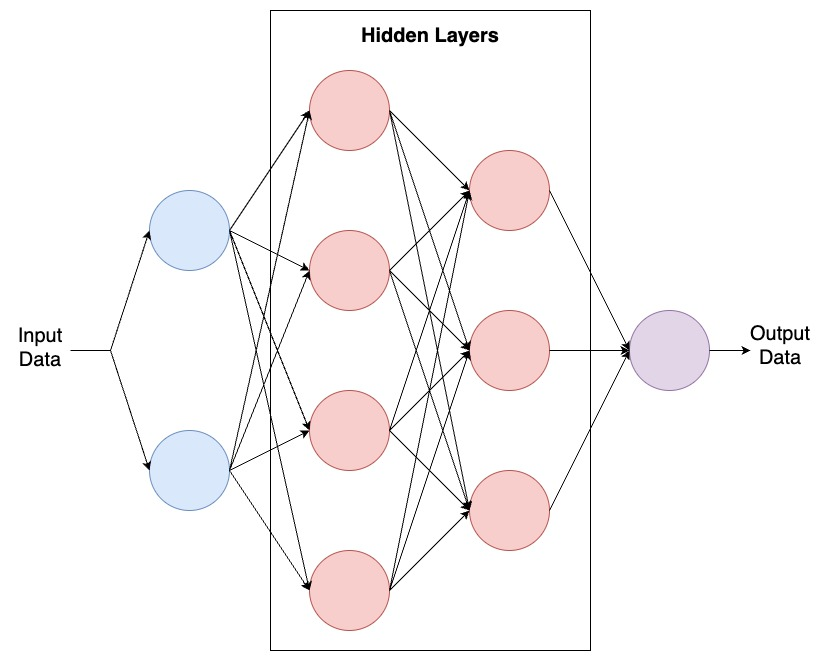
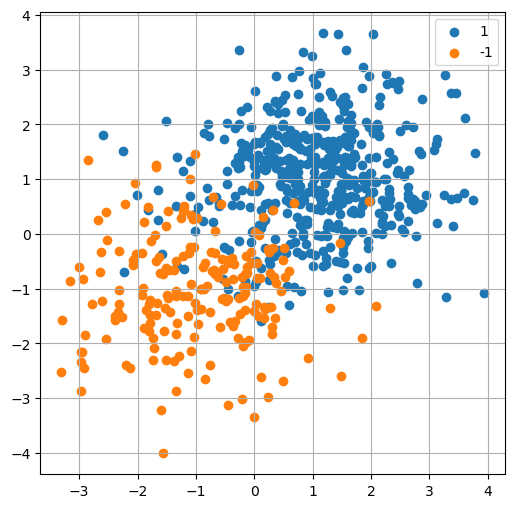
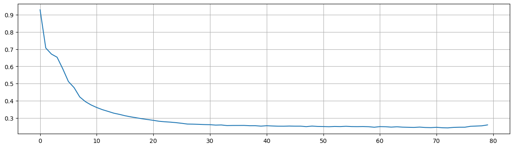
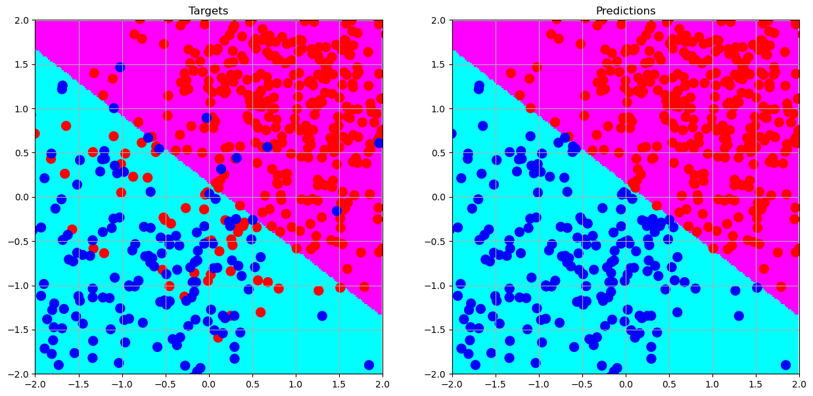
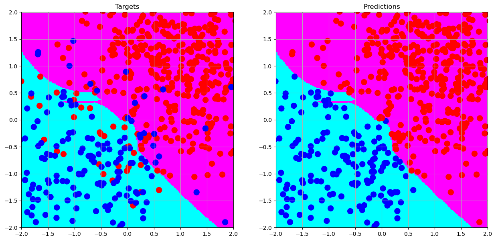
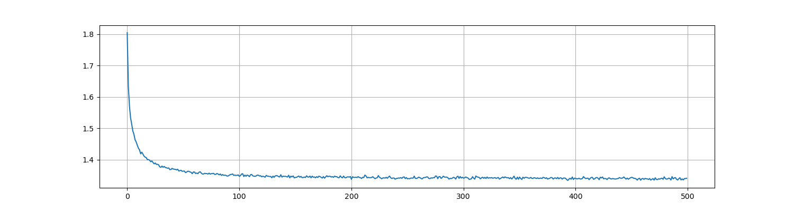

# Multilayer Perceptron from Scratch using NumPy
<p align="center">
  
  <br>
  Multilayer Perceptron
</p>

## :sparkles: 1. Introduction
This repository contains a framework for a Multilayer Perceptron implemented solely using NumPy, with the exception of one imported SciPy function. This project draws inspiration from both TensorFlow and PyTorch. As you delve deeper, you'll notice that constructing a model with this framework bears a resemblance to the style of TensorFlow. Furthermore, some specific implementations within the source code are influenced by PyTorch. If you're keen on understanding the design and usage of this framework, let's dive in!

## :sparkles: 2. A topy example
Let's dive into a toy example.
First, we need to import the necessary packages.
```python
import numpy as np
import matplotlib.pyplot as plt
from mlperceptron import Dense, MultilayerPerceptron
```
Then, we need to generate some random data points. Please note that for reproductivity, a random seed should be set.
```python
np.random.seed(3407)
class_1 = np.hstack([np.random.normal( 1, 1, size=(500, 2)),  np.ones(shape=(500, 1))])
class_2 = np.hstack([np.random.normal(-1, 1, size=(200, 2)), -np.ones(shape=(200, 1))])
dataset = np.vstack([class_1, class_2])
X, y = dataset[:,:2], dataset[:,2]
```
Let's take a quick look at what they look like.
```python
plt.figure(figsize=(6, 6))
plt.scatter(class_1[:,0], class_1[:,1], label='1')
plt.scatter(class_2[:,0], class_2[:,1], label='-1')
plt.grid()
plt.legend()
plt.show()
```

<p align="center">
  
  <br>
  Random Data Points
</p>

It looks cool! Let's construct our model.
```python
layers = [
    Dense(2, 4, activation='leaky_relu', init='kaiming_normal', init_params={'mode': 'out'}),
    Dense(4, 3, activation='hardswish', init='xavier_normal'),
    Dense(3, 2, activation='relu', init='kaiming_normal', init_params={'mode': 'in'}),
    Dense(2, 1, activation='tanh', init='xavier_uniform')
]
mlp = MultilayerPerceptron(layers)
mlp.compile(optimizer='Adam',
            loss='MeanSquareError')
mlp.fit(X, y, epochs=80)
```
We've already done it. Easy? That's what we want!
Let's check its loss through epochs.
```python
loss = mlp.loss_tracker()
plt.figure(figsize=(15,4))
plt.plot(loss)
plt.grid()
```
<p align="center">
  
  <br>
  Loss through epochs
</p>

Not bad! It seems to work as expected.

Finally, let's look at the decision boundary of our model.
<p align="center">
  
  <br>
  Decision Boundary
</p>

**That's awesome!!**

## :sparkles: 3. Key modules
### 3.1 Activations
- Hyperbolic Tangent(Tanh)
  - Formula:      
    $\mathrm{Tanh}(x) = \mathrm{tanh}(x) = \frac{\mathrm{exp}(x) - \mathrm{exp}(-x)}{\mathrm{exp}(x) + \mathrm{exp}(-x)}$
- Tanhshrink
  - Formula:      
    $\mathrm{Tanhshrink}(x) = x − \mathrm{tanh}(x)$
- Hardtanh
- Sigmoid
  - Formula:      
    $\mathrm{Sigmoid}(x) = \sigma(x) = \frac{1}{1 + \mathrm{exp}(-x)}$
- LogSigmoid
  - Formula:      
    $\mathrm{LogSigmoid}(x) = \mathrm{log}(\frac{1}{1 + \mathrm{exp}(-x)})$
- Hardsigmoid
- ReLU
  - Formula:
    $\mathrm{ReLU}(x) = \mathrm{max}(0, x)$
- ReLU6
  - Formula:
    $\mathrm{ReLU6}(x) = \mathrm{min}(\mathrm{max}(0,x),6)$
- leaky relu
  - Formula:      
    $\mathrm{LeakyReLU}(x) = \mathrm{max}(0,x) + \alpha * \mathrm{min}(0,x)$
- ELU
- CELU
  -  Formula:      
    $\mathrm{CELU}(x) = \mathrm{max}(0,x) + \mathrm{min}(0, \alpha * (\mathrm{exp}(x/\alpha) − 1))$
- SELU
  - Formula:      
    $\mathrm{SELU}(x) = \mathrm{scale} * (\mathrm{max}(0,x) + \mathrm{min}(0, \alpha * (\mathrm{exp}(x) − 1)))$
- GELU
  - Formula:      
    $\mathrm{GELU}(x) = 0.5 * x * (1 + \mathrm{Tanh}(\sqrt{\frac{2}{\pi}})) * (x + 0.044715 * x^3)$
- Mish
  - Formula:      
    $\mathrm{Mish}(x) = x * \mathrm{Tanh}(\mathrm{Softplus}(x))$
- Swish
  - Formula:      
    $\mathrm{Swish}(x)  = x * \sigma(x)$
- Hardswish
- Softplus
  - Formula:      
    $\mathrm{Softplus}(x)= \frac{1}{\beta} * \mathrm{log}(1 + \mathrm{exp}(\beta * x))$
- SoftSign
  - Formula:      
    $\mathrm{SoftSign}(x) = \frac{x}{1 + \vert x \vert}$
- SoftShrinkage
- HardShrink
- Threshold

Note that due to GitHub's markdown not supporting the piecewise function, some function formulas are not provided.

### 3.2 Layers
- **Dense**
  - Dense Layer (Fully Connected Layer)
  - **Definition**:      
    A Dense Layer, also known as a Fully Connected Layer, is a layer in a neural network where every input node (or neuron) is connected to every output node. It's termed "fully connected" or "dense" because all inputs and outputs are interconnected.
  - **Mathematical Representation**:      
    $y = f(Wx + b)$
    
- **BatchNorm**
  - Batch Normalization
  - **Definition**:      
    Batch Normalization is a technique used in neural networks to standardize the activations of a given input layer on a mini-batch, which helps to stabilize and accelerate the training process.
  - **Mathematical Representation**:      
    For a given mini-batch, $B$, of size $m$, with activations $x$:      
    $\mu_B = \frac{1}{m}\Sigma_{i=1}^m x_i$      
    $\sigma_B^2 = \frac{1}{m}\Sigma_{i=1}^m (x_i - \mu_B)^2$      
    $\hat {x_i} = \frac{x_i - \mu_B}{\sqrt{\sigma_B^2 + \epsilon}}$        
    $y_i = \gamma \hat {x_i} + \beta$
- **Dropout**:
  - **Definition**:      
    Dropout is a regularization technique used in neural networks where, during training, random subsets of neurons are "dropped out" (i.e., set to zero) at each iteration. This prevents the network from becoming overly reliant on any particular neuron and promotes a more generalized model.
- **Activ**:
  - Activation Layer
  - **Definition**:
    An Activation Layer in a neural network is a layer that applies a non-linear function to its inputs, transforming the data to introduce non-linearity into the model. This non-linearity allows the network to learn from error and make adjustments, which is essential for learning complex patterns. 

### 3.3 Optimizers
- SGD(including Momentum and Nesterov)
  - Required Parameter: lr
  - Default Parameter: momentum=0.0, nesterov=False, weight_decay=0.0
- Adagrad
  - Required Parameter: None
  - Default Parameter: lr=1.0, weight_decay=0.0, epsilon=1e-10
- Adadelta
  - Required Parameter: None
  - Default Parameter: lr=1.0, rho=0.9, epsilon=1e-06, weight_decay=0.0
- Adam
  - Required Parameter: None
  - Default Parameter: lr=1e-3, beta1=0.9, beta2=0.999, epsilon=1e-08, weight_decay=0.0

## :sparkles: 4. Instructions
### 4.1 Regularization
In the previous toy example, the structure of the model is:
```python
layers = [
    Dense(2, 4, activation='leaky_relu', init='kaiming_normal', init_params={'mode': 'out'}),
    Dense(4, 3, activation='hardswish', init='xavier_normal'),
    Dense(3, 2, activation='relu', init='kaiming_normal', init_params={'mode': 'in'}),
    Dense(2, 1, activation='tanh', init='xavier_uniform')
]
```
Given that our training data is relatively simple, regularizations aren't strictly necessary. However, if the model starts overfitting, consider applying regularization techniques. In such a scenario, the layers should be constructed as follows:
```python
layers = [
    Dense(2, 4, init='kaiming_normal', init_params={'mode': 'out'}),
    BatchNorm(4),
    Activ('leaky_relu'),
    Dropout(dropout_rate=0.2),
    Dense(4, 3, init='xavier_normal'),
    BatchNorm(3),
    Activ('hardswish'),
    Dropout(dropout_rate=0.2),
    Dense(3, 2, init='kaiming_normal', init_params={'mode': 'in'}),
    BatchNorm(2),
    Activ('relu'),
    Dropout(dropout_rate=0.2),
    Dense(2, 1, activation='tanh', init='xavier_uniform')
]
```
When employing regularization, follow this order: Linear -> BatchNorm -> Activ -> Dropout.

<p align="center">
  
  <br>
  Decision Boundary After Regularization
</p>

### 4.2 Optimizer
When training the model, the optimizer can be defined in the toy example as below:
```python
mlp.compile(optimizer='Adam',
            loss='MeanSquareError')
mlp.fit(X, y, epochs=80)
```
The default optimizer is utilized during the training process. However, it can also be customized:
- SGD
```python
optimizer = SGD(lr=1e-2)
```
- SGD with momentum:
```python
optimizer = SGD(lr=1e-2, momentum=0.9)
```
- Nesterov SGD:
```python
optimizer = SGD(lr=1e-2, momentum=0.9, nesterov=True)
```
After defining the optimizer, compile the model:
```python
mlp.compile(optimizer=optimizer,
            loss='MeanSquareError')
```
For using default settings, these two methods are equivalent:
```python
mlp.compile(optimizer='Adam',
            loss='MeanSquareError')
```
and
```python
mlp.compile(optimizer=Adam(),
            loss='MeanSquareError')
```
<p align="center">
  
  <br>
  Loss using SGD
</p>

### 4.3 Loss Functions
Not only can you use 'MeanSquareError', but you can also use 'CrossEntropy'. More interestingly, one-hot encoding is provided as an in-built method, so you don't need to pass preprocessed data to the model. However, ensure that the data passed to the model is in numerical encoding.

When compiling the model using 'CrossEntropy', you will see:
<p align="center">
  
  <br>
  Decision Boundary using Cross Entropy
</p>

### 4.4 Save and Load Our Model
We provide methods to save and load the model.
- How to save?
```python
# Assume mlp is a trained model
mlp.save('mlp.pickle')
```
- How to load?
```python
mlp = MultilayerPerceptron.load('mlp.pickle')
```

### 4.5 Progress Bar Integration

In our recent update, we have integrated the **'tqdm()'** function from the **'tqdm'** library into the training process. While this enhancement doesn't provide real-time metrics display during training, it introduces a progress bar. This bar not only visualizes the elapsed time for each epoch but also estimates the time of completion.

After completing the training procedure, the following output will be displayed in the VS Code terminal:

```100%|███████████████████████████████████████████████████████████████████████████████████████████████████████████████████████████████| 500/500 [22:38<00:00,  2.72s/it]```

## :sparkles: 5. Testing on a Complex Dataset
### 5.1 Dataset Overview
Our datasets, comprising both a training and test set, are **extremely balanced**. The number of features stands at 128, and label classes are integers ranging from 0 to 9. Notably, in my implementation, the multilayer perceptron automatically one-hot encodes them. Each class has 5,000 samples in the training set and 1,000 in the test set. Since these datasets are privately owned, they aren't uploaded to the GitHub repo. If interested, kindly email me, and I'll share a **portion** of the data for verification purposes. [Email me](mailto:jixu9182@uni.sydney.edu.au)

### 5.2 Step-by-Step Guide
#### Step 1. Import Required Libraries & Modules
Do note, if other optimizers or regularization methods are necessary, make sure to import them as required.
```python
import numpy as np
import matplotlib.pyplot as plt
from datasets.data_loader import datasets
from model.mlperceptron import MultilayerPerceptron, Dense, Dropout, Adam
from eval.metrics import accuracy
```
#### Step 2. Load the Datasets
Ensure that the labels are structured in a 1-D array with the shape (number_of_samples, ). Otherwise, it might trigger errors.
```python
X_train, y_train = datasets(train=True)
X_test, y_test = datasets(train=False)
print(f"The shape of X_train is {X_train.shape}, and the shape of y_train is {y_train.shape}.")
print(f"The classes in y_train are: {np.unique(y_train)}.")
```
Outputs:
```
The shape of X_train is (50000, 128), and the shape of y_train is (50000,).
The classes in y_train are: [0 1 2 3 4 5 6 7 8 9].
```

#### Step 3. Review the Label Distribution
For datasets that aren't balanced, you might need to employ preprocessing techniques.
```python
train_label_dist = dict.fromkeys(np.unique(y_train), 0)
test_label_dist = dict.fromkeys(np.unique(y_test), 0)

for y in y_train:
    train_label_dist[y] += 1
for y in y_test:
    test_label_dist[y] += 1

print(train_label_dist)
print(test_label_dist)

```
Outputs:
```
{6: 5000, 9: 5000, 4: 5000, 1: 5000, 2: 5000, 7: 5000, 8: 5000, 3: 5000, 5: 5000, 0: 5000}
{3: 1000, 8: 1000, 0: 1000, 6: 1000, 1: 1000, 9: 1000, 5: 1000, 7: 1000, 4: 1000, 2: 1000}
```
#### Step 4. Construct the Multilayer Perceptron
To ensure reproducibility, we've set a random seed here. The chosen architecture is based on past experience with deep-learning tasks. Don't hesitate to experiment with your designs. Due to my implementation specifics, some activation functions could be computationally intensive. Choose wisely.
```python
np.random.seed(3407)
layers = [
    Dense(128, 120, activation='elu', init='kaiming_uniform'),
    Dropout(dropout_rate=0.25),
    Dense(120, 112, activation='elu', init='kaiming_uniform'),
    Dropout(dropout_rate=0.20),
    Dense(112, 96, activation='elu', init='kaiming_uniform'),
    Dropout(dropout_rate=0.15),
    Dense(96, 64, activation='elu', init='kaiming_uniform'),
    Dropout(dropout_rate=0.10),
    Dense(64, 48, activation='elu', init='kaiming_uniform'),
    Dropout(dropout_rate=0.05),
    Dense(48, 32, activation='elu', init='kaiming_uniform'),
    Dense(32, 24, activation='elu', init='kaiming_uniform'),
    Dense(24, 16, activation='elu', init='kaiming_uniform'),
    Dense(16, 10, activation='softmax', init='xavier_uniform')
]
mlp = MultilayerPerceptron(layers)
mlp.compile(optimizer=Adam(lr=1e-3, weight_decay=0.02),
            loss='CrossEntropy')
```

#### Step 5. Train the Model and Present its Training Metrics
```python
mlp.fit(X_train, y_train, epochs=500, batch_size=32)
loss = mlp.loss_tracker()
train_time = mlp.training_time()
print(f'Training time: {train_time:.2f} second(s).')
print(f'Loss: {loss[-1]:.2f}.')
plt.figure(figsize=(15, 4))
plt.plot(loss)
plt.grid()
plt.show()
```
Outputs:
```
Training time: 1358.89 second(s).
Loss: 1.34.
```
<p align="center">
  
  <br>
  Training procedure
</p>

#### Step 6. Evaluate the Model
Though we've considered adding built-in metrics for model evaluation during development, metrics can vary significantly across different tasks. Hence, we'd recommend defining your evaluation strategies.

```python
print(f"Accuracy on the training set is: {accuracy(y_train, mlp.predict(X_train)):.2%}." )
print(f"Accuracy on the test set is: {accuracy(y_test, mlp.predict(X_test)):.2%}.")
```
Outputs:
```
Accuracy on the training set is: 59.72%.
Accuracy on the test set is: 55.69%.
```

If you wish to save the trained model, use the following code:
```python
mlp.save('mlp.pickle')
```
### 5.3 Simplified Model Option
For those seeking a satisfactory but not top-tier model, consider the following architecture:
```python
layers = [
    Dense(128, 96, activation='elu', init='xavier_uniform'),
    Dense(96, 64, activation='elu', init='xavier_uniform'),
    Dense(64, 48, activation='elu', init='xavier_uniform'),
    Dense(48, 32, activation='elu', init='xavier_uniform'),
    Dense(32, 24, activation='elu', init='xavier_uniform'),
    Dense(24, 16, activation='elu', init='xavier_uniform'),
    Dense(16, 10, activation='softmax', init='xavier_uniform')
]
mlp = MultilayerPerceptron(layers)
mlp.compile(optimizer=Adam(lr=2e-6, weight_decay=0.02),
            loss='CrossEntropy')
mlp.fit(X_train, y_train, epochs=600, batch_size=32)
```
This model provides consistent training and moderate performance. The training metrics are as follows:
```
Training time: 768.38 second(s).
Loss: 1.35.
```
<p align="center">
  
  <br>
  Training procedure
</p>

```
Accuracy on the training set is: 51.95%.
Accuracy on the test set is: 49.58%.
```

### 5.4 A Streamlined and Comprehensive Workflow
For clarity, the above steps might seem repetitive. Below is a more concise and efficient workflow, also found in the **run.py** file:

```python
import numpy as np
import matplotlib.pyplot as plt
from datasets.data_loader import datasets
from model.mlperceptron import MultilayerPerceptron, Dense, Dropout, Adam
from eval.metrics import accuracy

# Loading datasets
X_train, y_train = datasets(train=True)
X_test, y_test = datasets(train=False)

np.random.seed(3407)

# Defining the model architecture
layers = [
    Dense(128, 120, activation='elu', init='kaiming_uniform'),
    Dropout(dropout_rate=0.25),
    Dense(120, 112, activation='elu', init='kaiming_uniform'),
    Dropout(dropout_rate=0.20),
    Dense(112, 96, activation='elu', init='kaiming_uniform'),
    Dropout(dropout_rate=0.15),
    Dense(96, 64, activation='elu', init='kaiming_uniform'),
    Dropout(dropout_rate=0.10),
    Dense(64, 48, activation='elu', init='kaiming_uniform'),
    Dropout(dropout_rate=0.05),
    Dense(48, 32, activation='elu', init='kaiming_uniform'),
    Dense(32, 24, activation='elu', init='kaiming_uniform'),
    Dense(24, 16, activation='elu', init='kaiming_uniform'),
    Dense(16, 10, activation='softmax', init='xavier_uniform')
]

mlp = MultilayerPerceptron(layers)
mlp.compile(optimizer=Adam(lr=1e-3, weight_decay=0.02),
            loss='CrossEntropy')
mlp.fit(X_train, y_train, epochs=500, batch_size=32)

# Displaying training metrics
loss = mlp.loss_tracker()
train_time = mlp.training_time()
print(f'Training time: {train_time:.2f} second(s).')
print(f'Loss: {loss[-1]:.2f}.')
plt.figure(figsize=(15, 4))
plt.plot(loss)
plt.grid()
plt.show()

print(f"Accuracy on the training set is: {accuracy(y_train, mlp.predict(X_train)):.2%}." )
print(f"Accuracy on the test set is: {accuracy(y_test, mlp.predict(X_test)):.2%}.")

# Uncomment below to save the model
# mlp.save('mlp.pickle')
```

Alternatively, if you prefer to utilize our pre-trained model, refer to the following snippet, also available in the **load.py** file:
```python
from datasets.data_loader import datasets
from model.mlperceptron import MultilayerPerceptron
from eval.metrics import accuracy

# Loading datasets
X_train, y_train = datasets(train=True)
X_test, y_test = datasets(train=False)

# Loading the pre-trained model
mlp = MultilayerPerceptron.load('model_hub/mlp.pickle')

print(f"Accuracy on the training set is: {accuracy(y_train, mlp.predict(X_train)):.2%}." )
print(f"Accuracy on the test set is: {accuracy(y_test, mlp.predict(X_test)):.2%}.")
```
## :sparkles: 6. Project structure
```
├── data          
|   ├── train_data.npy
|   ├── train_label.npy
|   ├── test_data.npy
|   └── test_label.npy
|
├── datasets          
|   ├── data_loader.py
|   └── __init__.py
|
├── model_hub      
│   └── mlp.pickle
|         
├── models      
|   ├── mlperceptron.py
|   └── __init__.py    
|
├── outputs/      
│   └── # Some visualizations      
|
└── eval          
|   ├── metrics.py
|   └── __init__.py
|
├── run.py
├── load.py    
```

## :sparkles: 7. Update Log
This section lists the changes and updates made to the Multilayer Perceptron framework. Each update will include the version number, release date, and a brief summary of the changes made.

### Version: 2023-09-05
- **Added**: Integrated the **'tqdm()'** function from the **'tqdm'** library into the training process.
- **Re-organized**: Revamped the entire repository structure for improved integration and standardization.
- **Improved**: Enhanced the architecture of the multilayer perceptron for the specific task.
- **Future work**: Plan to integrate an **early stopping** strategy into the training procedure.