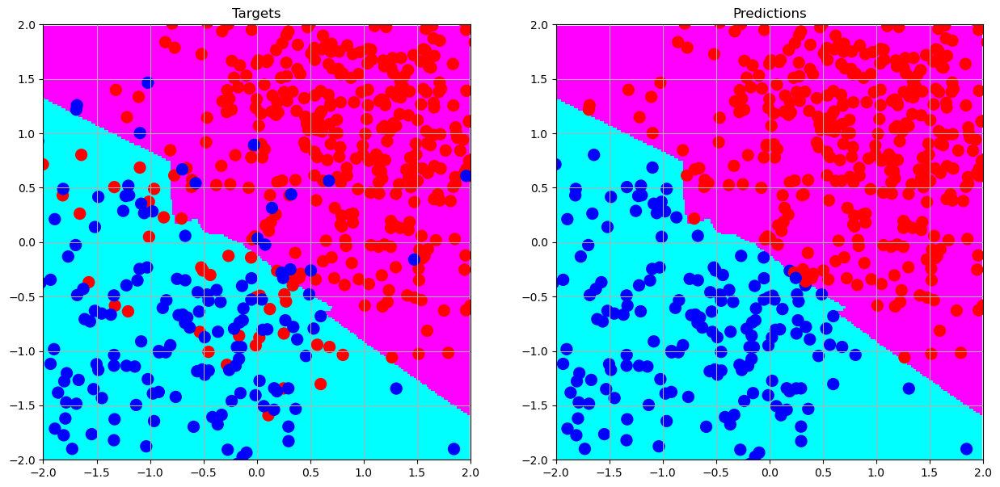
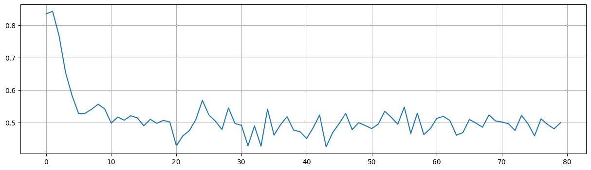
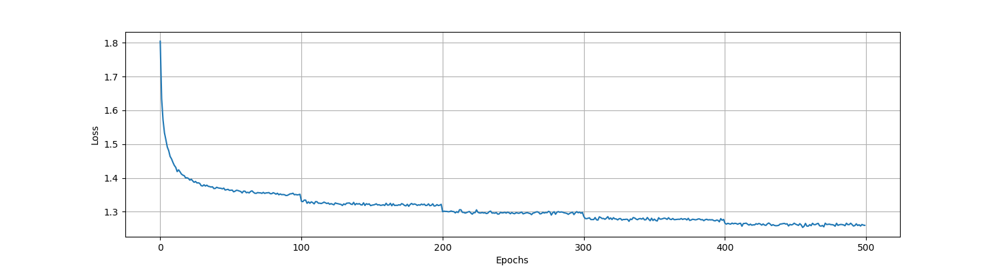
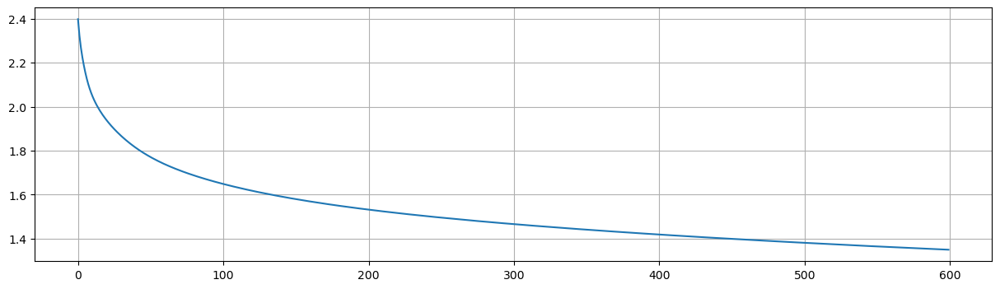

[English](README.md) | 中文版
# 用NumPy从零实现多层感知机

**目录**
- [1. 简介](#sparkles-1-简介)
- [2. 一个玩具样例](#sparkles-2-一个玩具样例)
- [3. 关键模块](#sparkles-3-关键模块)
  - [3.1. Activations](#31-activations)
  - [3.2. Layers](#32-layers)
  - [3.3. Optimizers](#33-optimizers)
  - [3.4. Learning Rate Scheduler](#34-learning-rate-scheduler)
  - [3.5. Callbacks](#35-callbacks)
- [4. 指导](#sparkles-4-指导)
- [5. 在一个复杂的数据集上测试](#sparkles-5-在一个复杂的数据集上测试)
- [6. 项目结构](#sparkles-6-项目结构)
- [7. 更新日志](#sparkles-7-更新日志)

<p align="center">
  
  <br>
  多层感知机
</p>

:tada: **令人兴奋的消息!**  
为了顺利的体验，我们现在将我们的项目通过启动Jupyter笔记本整合至谷歌Colab。立刻点击下方按钮探索吧！

[](https://colab.research.google.com/github/XavierSpycy/NumPyMultilayerPerceptron/blob/main/mlp_quickstart.ipynb)

:pushpin: **重要**:  
为了访问我们的仓库中的所有文件，确保您运行在这个笔记本中的`Setup` 代码块。这个`Toy Example`部分展示了我们下面的玩具样例。这个`Pipeline` 部分提供了一个在`run.py`中的直接的流程。请注意，相较于我们的本地设置，Colab中的训练时间或许不同。这个完整的训练大约花费58分钟（这取决于分配的虚拟机）。如果这个时间太长，考虑减少轮次数直到训练时长令您满意。

## :sparkles: 1. 简介
这个仓库包含一个多层感知机的框架，实现中除了一个从SciPy导入的函数外，只使用了NumPy。这个项目受到了TensorFlow和PyTorch的启发。随着你探索得越深入，你将会注意到用这个框架构建模型与TensorFlow的风格相似。另外，一些具体的实现的源码则受PyTorch的影响。如果你热衷于理解这个框架的设计和用法，那我们一起深入了解吧！

## :sparkles: 2. 一个玩具样例
让我们一起探索一个玩具样例。
首先，我们需要导入必要的包。
```python
import numpy as np
import matplotlib.pyplot as plt
from nn.mlp import MultilayerPerceptron
from nn.layers import Dense
```
接着，我们需要生成一些随机数据点。请注意，为了复现性，应该设置一个随机种子。
```python
np.random.seed(3407)
class_1 = np.hstack([np.random.normal( 1, 1, size=(500, 2)),  np.ones(shape=(500, 1))])
class_2 = np.hstack([np.random.normal(-1, 1, size=(200, 2)), -np.ones(shape=(200, 1))])
dataset = np.vstack([class_1, class_2])
X, y = dataset[:,:2], dataset[:,2]
```
我们一起快速地看一下它们的样子。
```python
plt.figure(figsize=(6, 6))
plt.scatter(class_1[:,0], class_1[:,1], label='1')
plt.scatter(class_2[:,0], class_2[:,1], label='-1')
plt.grid()
plt.legend()
plt.show()
```

<p align="center">
  
  <br>
  随机数据点
</p>

看起来很酷！我们一起构建我们的模型。
```python
layers = [
    Input(2),
    Dense(units=4, activation='leaky_relu', init='kaiming_normal', init_params={'mode': 'out'}),
    Dense(units=3, activation='hardswish', init='xavier_normal'),
    Dense(units=2, activation='relu', init='kaiming_normal', init_params={'mode': 'in'}),
    Dense(units=1, activation='tanh', init='xavier_uniform')
]
mlp = MultilayerPerceptron(layers)
mlp.compile(optimizer='Adam',
            metrics=['MeanSquareError'])
mlp.fit(X, y, epochs=3, batch_size=8, use_progress_bar=True)
```
当然, 在我们的实现中, 上述的过程等价于：
```python
mlp = MultilayerPerceptron()
mlp.add(Input(2))
mlp.add(Dense(units=4, activation='leaky_relu', init='kaiming_normal', init_params={'mode': 'out'}))
mlp.add(Dense(units=3, activation='hardswish', init='xavier_normal'))
mlp.add(Dense(units=2, activation='relu', init='kaiming_normal', init_params={'mode': 'in'}))
mlp.add(Dense(units=1, activation='tanh', init='xavier_uniform'))
```
我们已经完成它了。简单吧？那就是我们想要的！
我们来检查一下它随轮次的损失。
```python
mlp.plot_loss()
```
<p align="center">
  
  <br>
  随轮次的损失
</p>

不错！它看起来如期运行。

最后，我们一起看一下我们模型的决策边界。
<p align="center">
  
  <br>
  决策边界
</p>

**那棒极了！！**

## :sparkles: 3. 关键模块
### 3.1 Activations
因为该项目由一项作业演变而来，求导由手动完成而非自动。如有需要，可随意修改。
  - 公式：      
    $\mathrm{Tanh}(x) = \mathrm{tanh}(x) = \frac{\mathrm{exp}(x) - \mathrm{exp}(-x)}{\mathrm{exp}(x) + \mathrm{exp}(-x)}$
- Tanhshrink
  - 公式：      
    $\mathrm{Tanhshrink}(x) = x − \mathrm{tanh}(x)$
- Hardtanh
- Sigmoid
  - 公式：      
    $\mathrm{Sigmoid}(x) = \sigma(x) = \frac{1}{1 + \mathrm{exp}(-x)}$
- LogSigmoid
  - 公式：      
    $\mathrm{LogSigmoid}(x) = \mathrm{log}(\frac{1}{1 + \mathrm{exp}(-x)})$
- Hardsigmoid
- ReLU
  - 公式：
    $\mathrm{ReLU}(x) = \mathrm{max}(0, x)$
- ReLU6
  - 公式：
    $\mathrm{ReLU6}(x) = \mathrm{min}(\mathrm{max}(0,x),6)$
- Leaky relu
  - 公式：      
    $\mathrm{LeakyReLU}(x) = \mathrm{max}(0,x) + \alpha * \mathrm{min}(0,x)$
- ELU
- CELU
  -  公式：      
    $\mathrm{CELU}(x) = \mathrm{max}(0,x) + \mathrm{min}(0, \alpha * (\mathrm{exp}(x/\alpha) − 1))$
- SELU
  - 公式：      
    $\mathrm{SELU}(x) = \mathrm{scale} * (\mathrm{max}(0,x) + \mathrm{min}(0, \alpha * (\mathrm{exp}(x) − 1)))$
- GELU
  - 公式：      
    $\mathrm{GELU}(x) = 0.5 * x * (1 + \mathrm{Tanh}(\sqrt{\frac{2}{\pi}})) * (x + 0.044715 * x^3)$
- Mish
  - 公式：      
    $\mathrm{Mish}(x) = x * \mathrm{Tanh}(\mathrm{Softplus}(x))$
- Swish
  - 公式：      
    $\mathrm{Swish}(x)  = x * \sigma(x)$
- Hardswish
- Softplus
  - 公式：      
    $\mathrm{Softplus}(x)= \frac{1}{\beta} * \mathrm{log}(1 + \mathrm{exp}(\beta * x))$
- SoftSign
  - 公式：      
    $\mathrm{SoftSign}(x) = \frac{x}{1 + \vert x \vert}$
- SoftShrinkage
- HardShrink
- Threshold

注意，因为GitHub的markdown不支持分段函数，一些函数的公式并未提供。

### 3.2 Layers
- **Dense**
  - 稠密层 Dense Layer（全连接层 Fully Connected Layer）
  - **定义**:      
    一个稠密层，也称为全连接层，是神经网络中的一个层，其中所有的输入节点（或神经元）与每一个输出节点连接。它冠以“全连接”或者“稠密”，是因为所有的输入和输出都是互相连接的。
  - **数学表示：**:      
    $y = f(Wx + b)$
    
- **BatchNorm**
  - 批量归一化（Batch Normalization）
  - **定义**:      
    批量归一化是用于神经网络中的一项技术，以标准化给点输入层在小批量上的激活函数，它有助于标准化和加速训练过程。
  - **数学表示：**:      
    For a given mini-batch, $B$, of size $m$, with activations $x$:      
    $\mu_B = \frac{1}{m}\Sigma_{i=1}^m x_i$      
    $\sigma_B^2 = \frac{1}{m}\Sigma_{i=1}^m (x_i - \mu_B)^2$      
    $\hat {x_i} = \frac{x_i - \mu_B}{\sqrt{\sigma_B^2 + \epsilon}}$        
    $y_i = \gamma \hat {x_i} + \beta$
- **Dropout**:
  - **定义**:      
    丢弃法（Dropout）是一个用于神经网络中的正则化技术，其中，在训练过程中，神经元的随机子集在每次迭代中被“丢弃”（即，设为0）。这避免了网络过于依赖任意特定的神经元，促使一个更加泛化的模型。
- **Activ**:
  - 激活层（Activation Layer）
  - **定义**:
    在神经网络中的激活层是一层将非线性函数用于它的输入，转化数据以引入非线性至模型中。这样的非线性使得网络从错误中学习并做出调整，这是学习复杂模式的关键。

### 3.3 Optimizers
- SGD (including Momentum and Nesterov)
  - 必需参数： `lr`
  - 默认参数：`momentum=0.0`, `nesterov=False`, `weight_decay=0.0`
- Adagrad
  - 必需参数： None
  - 默认参数：`lr=1.0`, `weight_decay=0.0`, `epsilon=1e-10`
- Adadelta
  - 必需参数： None
  - 默认参数：`lr=1.0`, `rho=0.9`, `epsilon=1e-06`, `weight_decay=0.0`
- Adam
  - 必需参数： None
  - 默认参数：`lr=1e-3`, `beta1=0.9`, `beta2=0.999`, `epsilon=1e-08`, `weight_decay=0.0`

### 3.4 Learning Rate Scheduler
状态：稳定 - 达到预期效果
- StepLR
  - 必需参数：`optimizer`, `step_size`
  - 默认参数：`gamma=0.1`
- ConstantLR
  - 必需参数：`optimizer`
  - 默认参数：`factor=1./3`, `total_iters=5`
- MultiStepLR
  - 必需参数：`optimizer`, `milestones`
  - 默认参数：`gamma=0.1`

### 3.5 Callbacks
状态：稳定 - 达到预期效果(~~当前处于测试阶段~~)
- EarlyStopping:
  - 必需参数： `criterion`
  - 默认参数：`min_delta=0.0`, `patience=5`, `mode='min'`, `restore_best_weights=False`

## :sparkles: 4. 指导
### 4.1 正则化（Regularization）
在前面的玩具样例中，模型结构是：
```python
layers = [
    Input(2),
    Dense(units=4, activation='leaky_relu', init='kaiming_normal', init_params={'mode': 'out'}),
    Dense(units=3, activation='hardswish', init='xavier_normal'),
    Dense(units=2, activation='relu', init='kaiming_normal', init_params={'mode': 'in'}),
    Dense(units=1, activation='tanh', init='xavier_uniform')
]
```
假设我们的训练数据相对简单，正则化并不严格必要。然而，如果模型开始过拟合，考虑应用正则化技术。在这样的情况下，层应当构建如下：
```python
from nn.layers import BatchNorm, Dropout, Activ
layers = [
    Input(2),
    Dense(units=4, init='kaiming_normal', init_params={'mode': 'out'}),
    BatchNorm(4),
    Activ('leaky_relu'),
    Dropout(dropout_rate=0.2),
    Dense(units=3, init='xavier_normal'),
    BatchNorm(3),
    Activ('hardswish'),
    Dropout(dropout_rate=0.2),
    Dense(units=2, init='kaiming_normal', init_params={'mode': 'in'}),
    BatchNorm(2),
    Activ('relu'),
    Dropout(dropout_rate=0.2),
    Dense(units=1, activation='tanh', init='xavier_uniform')
]
```
当使用正则化时，按照这个顺序：Linear -> BatchNorm -> Activ -> Dropout。

<p align="center">
  
  <br>
  正则化后的决策边界
</p>

### 4.2 优化器（Optimizer）
当训练模型时，优化器在玩具样例中可以有如下定义：
```python
mlp.compile(optimizer='Adam',
            metrics='MeanSquareError')
mlp.fit(X, y, epochs=3)
```
训练过程将使用默认的优化器。然而，它也是可以自定义的：
- SGD
```python
optimizer = SGD(lr=1e-2)
```
- SGD with momentum:
```python
optimizer = SGD(lr=1e-2, momentum=0.9)
```
- Nesterov SGD:
```python
optimizer = SGD(lr=1e-2, momentum=0.9, nesterov=True)
```
在定义优化器后，编译这个模型：
```python
mlp.compile(optimizer=optimizer,
            metrics=['MeanSquareError'])
```
对于使用默认设置时，这两个方法是等价的：
```python
mlp.compile(optimizer='Adam',
            metrics=['MeanSquareError'])
```
and
```python
mlp.compile(optimizer=Adam(),
            metrics=['MeanSquareError'])
```
<p align="center">
  
  <br>
  用SGD的损失
</p>

### 4.3 损失函数
不仅仅可以使用`MeanSquareError`，您还可以使用but you can also use `CrossEntropy`。更有意思的是，独热编码作为内置方法已提供，所以您无需传入预处理后的数据给模型。但是，请确保传入模型的数据是数值编码的。

当用`CrossEntropy`编译模型时，您将看到：
<p align="center">
  
  <br>
  用交叉熵的决策边界
</p>

### 4.4 学习率调度器（Learning Rate Scheduler）
在训练中动态调整学习率对于优化模型性能是关键的。为此目的，学习率调度器提供了一类方法。如下所示，来自`nn.schedules`的`MultiStepLR`在特定的'milestones'处调整学习率。

```python
from nn.schedules import MultiStepLR

mlp = MultilayerPerceptron(layers)
optimizer = Adam(lr=1e-3, weight_decay=0.02)
scheduler = MultiStepLR(optimizer, milestones=[100, 200, 300, 400], gamma=0.8)
mlp.compile(optimizer=optimizer,
            metrics=['CrossEntropy'],
            scheduler=scheduler)
```

下图提供了学习率调整的可视化表示。注意，这些‘跳跃’对应了特定的'milestones'：

<p align="center">
  
  <br>
  用MultiStepLR的随轮次的损失
</p>

正如可以从图中推断的，这个学习率调度器显著地提升了模型的性能。

### 4.5 保存和加载我们的模型
我们提供了保存和加载模型的方法。
- 如何保存？
```python
# Assume mlp is a trained model
mlp.save('mlp.pickle')
```
- 如何加载？
```python
mlp = MultilayerPerceptron.load('mlp.pickle')
```

### 4.6 进度条整合
在我们最近的更新中，我们整合了来自`tqdm` 库的`tqdm()`函数。尽管这个优化不提供训练中的实时指标，但它引入了进度条。该进度条不仅仅可视化了每个轮次的消耗时间，还预计完成的时间。

在训练过程中，以下的输出将会显示在VS Code终端：

```47%|████████████████████████████████████████████████████████████▏                                                                  | 237/500 [10:15<11:26,  2.61s/it]```

## :sparkles: 5. 在一个复杂的数据集上测试
### 5.1 数据集概况
我们的数据集，包括训练集和测试集，**极度均衡**。特征数是128，标签类别是从0至9的整数。值得注意的是，在我们的实现中，多层感知机自动对它们独热编码。每个类别在训练集中有5000个样本，在测试集中有1000个样本。**数据集已于Oct. 2, 2023的更新中发布。**

我们也已用谷歌Colab的内置数据集（MNIST & California Housing Price）进行测试。您可以在`Quick Start`部分下的Jupyter笔记本中找到更多细节。

### 5.2 按步指南
#### 步骤 1. 导入必需的库和模块
注意，如果其它的优化器或正则化方法是必要的，则确保它们也被导入。
```python
import numpy as np
from datasets.data_loader import datasets
from nn.mlp import MultilayerPerceptron
from nn.layers import Dense, Dropout
from nn.optim import Adam
from sklearn.metrics import accuracy_score as accuracy
```
#### 步骤 2. 加载数据集
确保标签被构造成一维数列，具备形状(number_of_samples, )。否则，它可能引发错误。
```python
X_train, y_train = datasets(train=True)
X_test, y_test = datasets(train=False)
print(f"The shape of X_train is {X_train.shape}, and the shape of y_train is {y_train.shape}.")
print(f"The classes in y_train are: {np.unique(y_train)}.")
```
输出：
```
The shape of X_train is (50000, 128), and the shape of y_train is (50000,).
The classes in y_train are: [0 1 2 3 4 5 6 7 8 9].
```

#### 步骤 3. 查看标签分布
对于不平衡的数据集，您可能需要使用预处理技术。
```python
train_label_dist = dict.fromkeys(np.unique(y_train), 0)
test_label_dist = dict.fromkeys(np.unique(y_test), 0)

for y in y_train:
    train_label_dist[y] += 1
for y in y_test:
    test_label_dist[y] += 1

print(train_label_dist)
print(test_label_dist)

```
输出：
```
{6: 5000, 9: 5000, 4: 5000, 1: 5000, 2: 5000, 7: 5000, 8: 5000, 3: 5000, 5: 5000, 0: 5000}
{3: 1000, 8: 1000, 0: 1000, 6: 1000, 1: 1000, 9: 1000, 5: 1000, 7: 1000, 4: 1000, 2: 1000}
```
#### 步骤 4. 构建多层感知机
为了确保复现性，我们在这里已经设置一个随机种子。选定的架构基于过往深度学习任务的经验。请不要犹豫实验您自己的设计。由于我们具体的实现，一些激活函数可能计算性密集。谨慎选择。

<p align="center">
  
  <br>
  该架构
</p>

```python
np.random.seed(3407)
layers = [
    Input(128),
    Dense(units=120, activation='elu', init='kaiming_uniform'),
    Dropout(dropout_rate=0.25),
    Dense(units=112,  init='kaiming_uniform'),
    Dropout(dropout_rate=0.20),
    Dense(units=96, activation='elu', init='kaiming_uniform'),
    Dropout(dropout_rate=0.15),
    Dense(units=64, activation='elu', init='kaiming_uniform'),
    Dropout(dropout_rate=0.10),
    Dense(units=48, activation='elu', init='kaiming_uniform'),
    Dropout(dropout_rate=0.05),
    Dense(units=32, activation='elu', init='kaiming_uniform'),
    Dense(units=24, activation='elu', init='kaiming_uniform'),
    Dense(units=16, activation='elu', init='kaiming_uniform'),
    Dense(units=10, activation='softmax')
]
mlp = MultilayerPerceptron(layers)
mlp.compile(optimizer=Adam(lr=1e-3, weight_decay=0.02),
            metrics=['CrossEntropy', 'Accuracy'])
```

#### 步骤 5. 训练模型并展示其指标
```python
mlp.fit(X_train, y_train, epochs=500, batch_size=32)
loss = mlp.loss_tracker()
train_time = mlp.training_time()
print(f'Training time: {train_time:.2f} second(s).')
print(f'Loss: {loss[-1]:.2f}.')
mlp.plot_loss()
```
输出：
```
Training time: 1358.89 second(s).
Loss: 1.34.
```
<p align="center">
  
  <br>
  训练过程
</p>

#### 步骤 6. 评价模型
尽管我们在开发过程中已经考虑到为模型评价加入内置的指标，但指标随不同的任务显著变化。因此，我们推荐定义你自己的评价策略。

```python
print(f"Accuracy on the training set is: {accuracy(y_train, mlp.predict(X_train)):.2%}." )
print(f"Accuracy on the test set is: {accuracy(y_test, mlp.predict(X_test)):.2%}.")
```
输出：
```
Accuracy on the training set is: 59.72%.
Accuracy on the test set is: 55.69%.
```

如果您希望保存训练好的模型，可以使用如下的代码：
```python
mlp.save('mlp.pickle')
```
### 5.3 简化模型选择
对于那些追求仅满意但不顶级的模型，可以考虑下面的架构：

<p align="center">
  
  <br>
 简化的架构
</p>

```python
layers = [
    Input(128),
    Dense(units=120, activation='elu', init='kaiming_uniform'),
    Dropout(dropout_rate=0.25),
    Dense(units=112,  init='kaiming_uniform'),
    Dropout(dropout_rate=0.20),
    Dense(units=96, activation='elu', init='kaiming_uniform'),
    Dropout(dropout_rate=0.15),
    Dense(units=64, activation='elu', init='kaiming_uniform'),
    Dropout(dropout_rate=0.10),
    Dense(units=48, activation='elu', init='kaiming_uniform'),
    Dropout(dropout_rate=0.05),
    Dense(units=32, activation='elu', init='kaiming_uniform'),
    Dense(units=24, activation='elu', init='kaiming_uniform'),
    Dense(units=16, activation='elu', init='kaiming_uniform'),
    Dense(units=10, activation='softmax')
]
mlp = MultilayerPerceptron(layers)
mlp.compile(optimizer=Adam(lr=2e-6, weight_decay=0.02),
            loss='CrossEntropy')
mlp.fit(X_train, y_train, epochs=600, batch_size=32)
```
这个模型提供了一致性的训练和适中的性能。训练指标如下：
```
Training time: 768.38 second(s).
Loss: 1.35.
```
<p align="center">
  
  <br>
  训练过程
</p>

```
Accuracy on the training set is: 51.95%.
Accuracy on the test set is: 49.58%.
```

### 5.4 一条流线的、完整的工作流
为了阐释，上面的步骤或许略显重复。下面的是一个更加简洁和高效的工作流，也可以在`run.py`文件中找到：

```python
import numpy as np
from datasets.data_loader import datasets
from nn.mlp import MultilayerPerceptron
from nn.layers import Input, Dense, Dropout
from nn.optim import Adam
from nn.schedules import MultiStepLR
from nn.callbacks import EarlyStopping
from sklearn.metrics import accuracy_score as accuracy

# Load the data
X_train, y_train = datasets(train=True)
X_test, y_test = datasets(train=False)

# Set the random seed
np.random.seed(3407)

# Build the model
layers = [
    Input(128),
    Dense(units=120, activation='elu', init='kaiming_uniform'),
    Dropout(dropout_rate=0.25),
    Dense(units=112,  init='kaiming_uniform'),
    Dropout(dropout_rate=0.20),
    Dense(units=96, activation='elu', init='kaiming_uniform'),
    Dropout(dropout_rate=0.15),
    Dense(units=64, activation='elu', init='kaiming_uniform'),
    Dropout(dropout_rate=0.10),
    Dense(units=48, activation='elu', init='kaiming_uniform'),
    Dropout(dropout_rate=0.05),
    Dense(units=32, activation='elu', init='kaiming_uniform'),
    Dense(units=24, activation='elu', init='kaiming_uniform'),
    Dense(units=16, activation='elu', init='kaiming_uniform'),
    Dense(units=10, activation='softmax')
]

mlp = MultilayerPerceptron(layers)
optimizer = Adam(lr=1e-3, weight_decay=0.02)
scheduler = MultiStepLR(optimizer, milestones=[100, 200, 300, 400], gamma=0.8)
mlp = MultilayerPerceptron(layers)
optimizer = Adam(lr=1e-3, weight_decay=0.2)
scheduler = MultiStepLR(optimizer, milestones=[20, 40, 60, 80], gamma=0.8)
earlystopping = EarlyStopping(accuracy, patience=10, mode='max', restore_best_weights=True, start_from_epoch=20)
mlp.compile(optimizer=optimizer,
            metrics=['CrossEntropy', 'Accuracy'],
            scheduler=scheduler
)
mlp.fit(X_train, y_train, 
        epochs=90, batch_size=128, 
        validation_data=(X_test, y_test), use_progress_bar=True, 
        callbacks=[earlystopping]
)
# Evaluate the model
loss = mlp.loss_tracker()
train_time = mlp.training_time()
print(f'Training time: {train_time:.2f} second(s).')
print(f'Loss: {loss[-1]:.2f}.')
mlp.plot_loss()

print(f"Accuracy on the training set is: {accuracy(y_train, mlp.predict(X_train)):.2%}." )
print(f"Accuracy on the test set is: {accuracy(y_test, mlp.predict(X_test)):.2%}.")

# mlp.save('mlp.pickle')
```
使用学习率调度器可以提高大约2-3%的正确率。

或者，如果您更喜欢用我们的预训练模型，参考接下来的代码块，也在文件`load.py`中提供：
```python
from datasets.data_loader import datasets
from nn.mlp import MultilayerPerceptron
from sklearn.metrics import accuracy_score as accuracy
from sklearn.metrics import precision_score

# Load the data
X_train, y_train = datasets(train=True)
X_test, y_test = datasets(train=False)

# Load the model
mlp = MultilayerPerceptron.load('model_hub/mlp.pickle')

# Evaluate the model
print(f"Accuracy on the training set is: {accuracy(y_train, mlp.predict(X_train)):.2%}." )
print(f"Accuracy on the test set is: {accuracy(y_test, mlp.predict(X_test)):.2%}.")
print(f"Precision on the training set is: {precision_score(y_train, mlp.predict(X_train), average='weighted'):.2%}." )
print(f"Precision on the test set is: {precision_score(y_test, mlp.predict(X_test), average='weighted'):.2%}.")
```
## :sparkles: 6. 项目结构
```
├── data/          
|   ├── train_data.npy
|   ├── train_label.npy
|   ├── test_data.npy
|   └── test_label.npy
|
├── datasets/          
|   ├── data_loader.py
|   └── __init__.py
|
├── model_hub/      
│   └── mlp.pickle
|         
├── nn/      
|   ├── callbacks.py
|   ├── functional.py
|   ├── layers.py
|   ├── mlp.py
|   ├── optim.py
|   └── __init__.py    
|
├── figures/
|   ├── *.svg     
│   └── *.png   
|
├── eval/          
|   ├── metrics.py
|   └── __init__.py
|
├── LICENSE
├── mlp_quickstart.ipynb
├── README.md
├── README.zh-CN.md
├── run.py
└── load.py    
```

## :sparkles: 7. 更新日志
这个部分列举了对多层感知机框架做出的更改和更新。每次更新将包括版本序号，发布日期和作出更改的一个简单总结。

### 版本更新：2023-09-05
- **增加**：整合`tqdm`库中的`tqdm()`函数至训练过程中.
- **重排**：改进整个仓库结构以提高统一性和标准化。
- **提高**：提升为特定任务的多层感知机架构。
- **未来工作**：计划整合**早停**到训练过程。(已完成。)

### 仓库更新：2023-10-02
- **增加**：发布数据集。
- **修复**：修复README.md中几处笔误。

### 仓库更新：2023-10-07
- **增加**：为顺利与谷歌Colab整合，引入一个名为`mlp_quickstart.ipynb`的Jupyter笔记本。
- **提升**：为清晰和更好的用户浏览，融合表情并润色内容，以改进README.md。
- **未来工作**：计划完成各个模块的文档字符串。

### 版本和仓库更新：2023-10-18
- **模块**：流水线化并重新分解代码库以确保更清晰、更直观的用户体验。
- **增加**：顺利地整合了用谷歌Colab内置数据集的架构构建和性能测试。
- **提升**：引入新方法至`MultilayerPerceptron`，升高了它的功能性和多样性。
- **整合**：同时融合`EarlyStopping`和`LearningRateScheduler`，提供精炼的训练控制。
- **进步**：完成部分模块的文档字符串，铺平通向更清晰的开发者洞见的道路。

### 版本更新: 2023-11-22
- **简化**: 简化了部分实现，尤其是用户界面。
- **提升**: 增强了部分功能。

### 仓库更新: 2023-11-24
- **完成**: 完成了所有模块的文档字符串，增强了整个代码库的清晰度和开发者理解。